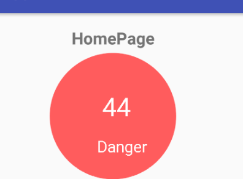
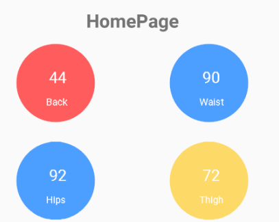
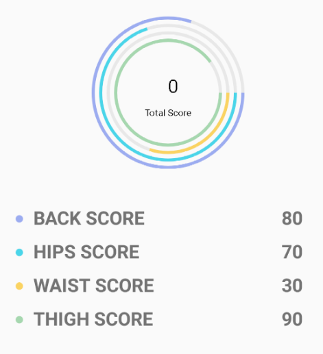
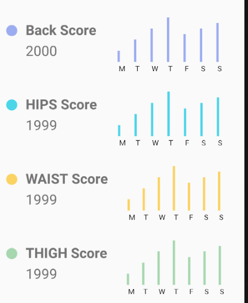

# Wheel-chair
wheel-chair APP

## 结构

MyApplication 文件为整个工程文件

Demo为演示视频


## 数据交互3个部分，可直接调用setData

* MainActivity中

``` 
    private void SetDate(int[] data)
    
    //使用例子
    //data分别为Total, Back, Waist, Hips，Thigh的分值
    int [] data={44,44,90,92,72};
    SetDate(data);
```





* Data_day 中

```
    public void setData(int[] data)

    //使用例子
    //data分别为Total, Back, Waist, Hips，Thigh的分值
    int []datas = {0,80,70,30,90};
    setData(datas);
```



* Data_week

```
 /*
    * 设置数据
    * type：表示哪一种Score. 1:Back， 2：HIPS, 3:WAIST, 4:THIGH
    * data：周一到周日的分数
    * score：总分数
    * */
    private void setData(int type, int[] datas, int score)

    //使用例子
    //分别为周一到周日的分数
    int[] datas = {20, 40, 60, 80, 50, 60, 70};
    //总分数
    int score = 2000;
    setData(1, datas, score);

```

